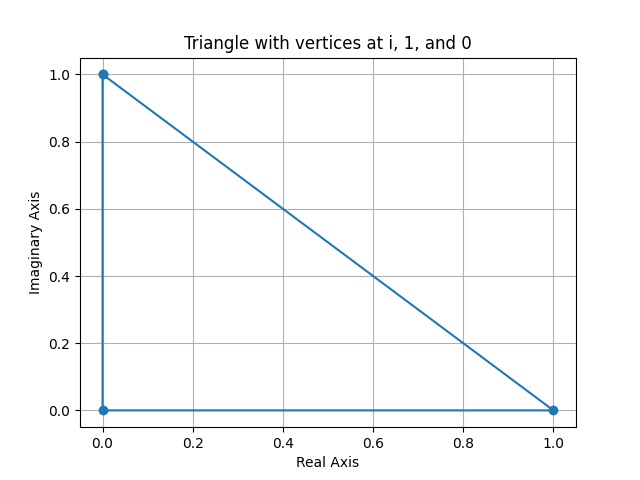

# Triangle Plotting Script

This Python script plots a triangle with vertices at the points `i`, `1`, and `0` on the complex plane. The x-axis represents the **Real Axis**, and the y-axis represents the **Imaginary Axis**.

## Requirements

- Python 3.x
- Matplotlib library

## Installation

1. Ensure you have Python installed. You can download it from [python.org](https://www.python.org/).
2. Install the required library using pip:

   ```bash
   pip install matplotlib
   ```

## Usage

1. Save the script as `0=i+1.py`.
2. Run the script using Python:

   ```bash
   python 0=i+1.py
   ```

3. A plot will be displayed showing the triangle with vertices at:
   - `(0, 1)` representing the imaginary unit `i`,
   - `(1, 0)` representing the real number `1`,
   - `(0, 0)` representing the origin `0`.

## Output

The script generates a plot with the following features:
- A triangle connecting the points `(0, 1)`, `(1, 0)`, and `(0, 0)`.
- The x-axis labeled as the **Real Axis**.
- The y-axis labeled as the **Imaginary Axis**.
- A grid for better visualization.

## Example



## License

This project is open-source and available under the MIT License.
```

### Notes:
- Replace `triangle_plot.png` with an actual screenshot of the plot if you want to include an example image in the README.
- Ensure the script and README are in the same directory for easy reference.
